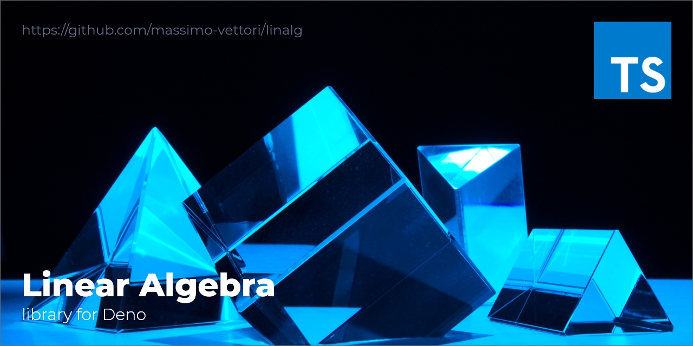

  <h1>🦕 numts</h1>
   
  
<em>Simple Linear Algebra library, written in TypeScript for Deno</em>

 

# 🚥 Roadmap
- [ ] Generic extensible abstract **NDArray** class
   - [x] Abstract algebra operations
   - [ ] Shape manipulation methods

 

- [x] **Vector** class
   - [x] Operations between *Vectors*
   - [x] Operations between *Vectors* and *Scalars*
   - [x] Operations between *Vectors* and other *NDArrays*

 

- [x] **Matrix** class
   - [x] Operations between *Matrices*
   - [x] Operations between *Matrices* and *Scalars*
   - [x] Operations between *Matrices* and other *NDArrays*

 

- [x] **Tensor** class
   - [x] Operations between *Tensors*
   - [x] Operations between *Tensors* and *Scalars*
   - [ ] Operations between *Tensors* and other *NDArrays*

 

# 🚧 Warning: W.I.P. Project

This project is under development *(incomplete at the moment)*, there will be some
breaking changes / bugs / errors...

Use it at your own risk, but if so, feel free to open an issue for any bug or problem you encounter.
